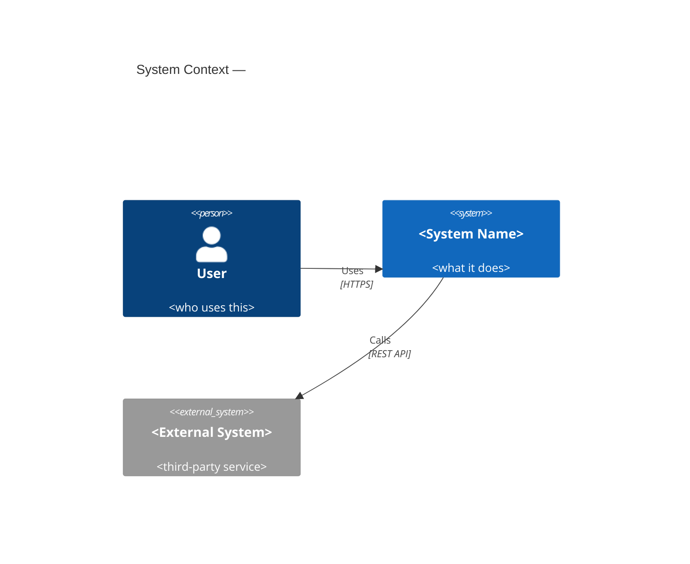
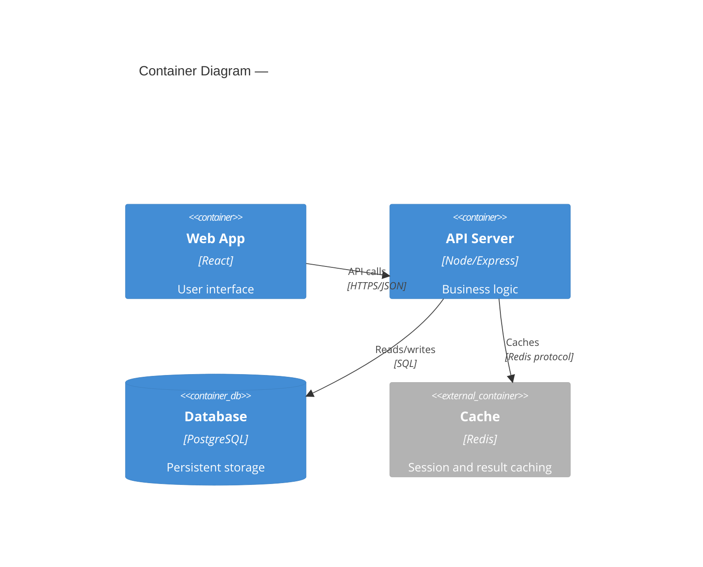
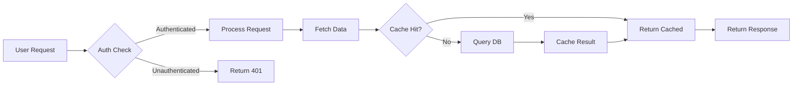
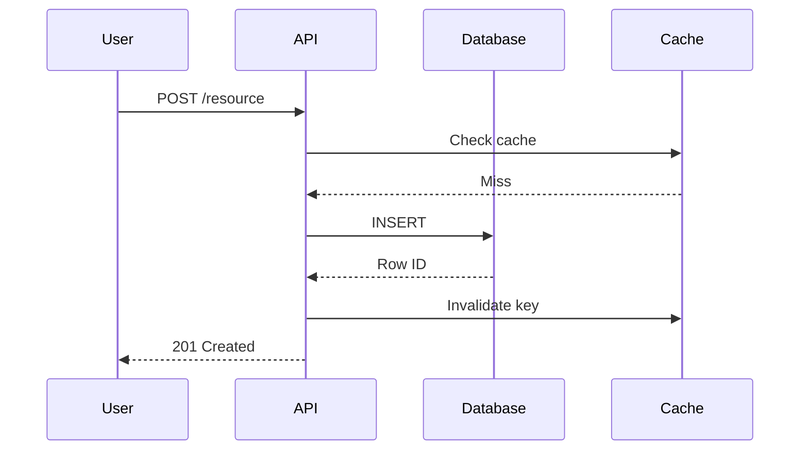
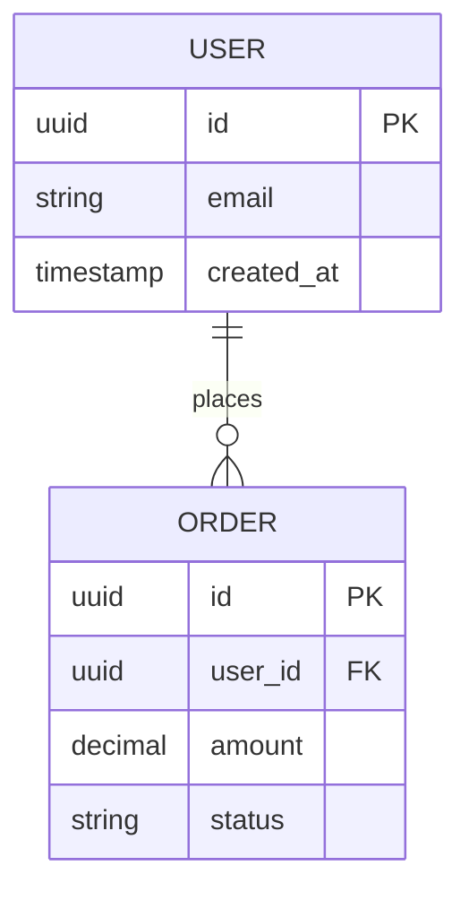

# Architect Pro

Generate a C4 or Mermaid diagram before any implementation begins. Do not write implementation code until the user confirms the architecture is correct.

## Core Rule

The diagram is the deliverable of this skill. Implementation is a separate subsequent step. After producing the diagram, ask for confirmation and stop.

## Diagram Selection

| Scenario | Diagram Type |
|---|---|
| New system or major feature | C4 Context + Container |
| Data flow or process | Mermaid flowchart (`graph LR`) |
| Sequence of interactions between components | Mermaid sequence diagram |
| Database schema | Mermaid entity-relationship diagram |
| State machine or lifecycle | Mermaid state diagram |
| Zooming into an existing system | C4 Component diagram |

When in doubt between flowchart and sequence diagram: if time/order matters, use sequence; if topology matters, use flowchart.

## C4 Templates

### Context Level (start here for new systems)

### Container Level (zoom in to services)

## Mermaid Templates

### Flowchart

### Sequence Diagram

### Entity-Relationship

## Workflow

1. If the scope is ambiguous, ask one focused clarifying question before drawing
2. Select the appropriate diagram type
3. Generate the diagram
4. Add a written summary beneath it:
   - Key design decisions made and why
   - Assumptions encoded in the diagram
   - Alternatives considered and why they were rejected (one sentence each)
5. Ask: "Does this architecture look correct? Any changes before we start implementation?"
6. Wait for explicit confirmation — do not proceed to implementation on the same turn

## Diagram Quality Standards

- Label every external system or service with its communication protocol (REST, gRPC, WebSocket, SQL, etc.)
- Label every data store with its technology (PostgreSQL, Redis, S3, etc.)
- Show both the happy path and at least one failure or error path
- Verify the diagram renders correctly before presenting (valid Mermaid syntax)
