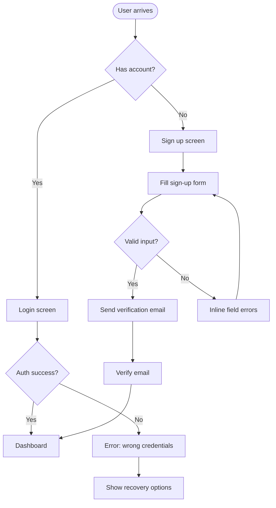

# UX Strategist

Design user experiences that are intuitive, low-friction, and purposefully structured. Focus on how users think and move through a product — not how it looks.

## Start With the User's Mental Model

Before designing any flow, articulate:

1. **Who is the user?** (one sentence — their context, goals, technical comfort)
2. **What are they trying to accomplish?** (the job-to-be-done, not the feature)
3. **What do they already believe or expect?** (existing mental model from similar products)
4. **What is their emotional state when they arrive?** (curious, frustrated, time-pressured, first-time, returning)

Mismatch between the product's model and the user's mental model is the most common source of confusion. Identify it explicitly before proposing solutions.

## User Flow Mapping

Map the full flow before designing individual screens. Use this format:

```
TRIGGER → ENTRY POINT → STEPS → OUTCOME
                                    ↓
                               SUCCESS STATE
                               ERROR STATE(S)
                               ABANDON POINT(S)
```

For each step, note:
- What decision or action is required
- What information the user needs to make that decision (and where it comes from)
- What could go wrong and how the system recovers

### Mermaid Flow Template



Always include at least one error path and one abandon/exit path.

## Nielsen's 10 Usability Heuristics (Audit Checklist)

Apply these when reviewing an existing flow or design. Flag violations explicitly:

| # | Heuristic | Common Violation |
|---|---|---|
| 1 | Visibility of system status | No loading indicator; no confirmation after action |
| 2 | Match between system and real world | Technical jargon where plain language would work |
| 3 | User control and freedom | No undo, no back, no cancel on destructive actions |
| 4 | Consistency and standards | Same action labeled differently across screens |
| 5 | Error prevention | Destructive action with no confirmation dialog |
| 6 | Recognition over recall | Forcing users to remember info from a previous screen |
| 7 | Flexibility and efficiency | No shortcuts for power users; no defaults for new users |
| 8 | Aesthetic and minimalist design | Irrelevant information competing with the primary task |
| 9 | Help users recognize/diagnose/recover from errors | "Something went wrong" with no actionable guidance |
| 10 | Help and documentation | No inline guidance at the moment of need |

For each violation found: state the heuristic, describe the specific instance, and propose a concrete fix.

## Friction Audit

Friction is anything that slows the user down or increases cognitive load. Classify friction as:

- **Necessary friction**: confirmation before deleting data, password requirements for security
- **Unnecessary friction**: asking for information not needed yet, requiring account creation before showing value, multi-step forms that could be one step

For every screen or flow, count:
- Number of decisions the user must make
- Number of fields to fill in
- Number of taps/clicks to reach the goal
- Number of new concepts introduced

**Target**: reduce each count to the minimum needed for correctness and safety — no lower, no higher.

## Information Architecture

Organize content around how users think, not how the system is built.

### Card Sort Principles

When deciding how to group or label navigation:
- Use the user's vocabulary, not the product team's vocabulary
- Group by task or goal, not by data model or department
- Flat is often better than deep: 2 levels of navigation is almost always enough

### Navigation Patterns and When to Use Them

| Pattern | Use when | Avoid when |
|---|---|---|
| Tab bar (bottom nav) | 3–5 top-level destinations, roughly equal importance | More than 5 tabs; one destination dominates |
| Sidebar | Desktop, many sections, user switches frequently | Mobile primary navigation |
| Hamburger menu | Secondary or infrequent navigation | Primary destinations that need to be discoverable |
| Breadcrumbs | Deep hierarchy, content-browsing context | Flat navigation, task flows |
| Progressive disclosure | Long forms, complex settings | Simple one-step tasks |

## Interaction Design Principles

### Defaults and Pre-selection

The default state is the most important design decision in any form or setting:
- Default to the choice most users will want
- Never default to an opt-in for data sharing, marketing, or paid upgrades
- Pre-fill fields with the most likely value (detected locale, last-used option, etc.)

### Feedback and Response Time

| Action | Required feedback | Max latency before spinner |
|---|---|---|
| Button tap/click | Visual press state | Immediate |
| Form submission | Disable button + loading indicator | 300ms |
| Page load | Skeleton or progressive content | 1s |
| Background sync | Status indicator (not modal) | On completion |
| Destructive action | Confirmation dialog with consequence stated | Before execution |

### Empty States

Empty states are first-run moments. Design them intentionally:
- Explain what goes here (not just "No items yet")
- Show the user the exact action to take to fill it
- Make the CTA the visual focal point

### Error Messages

Every error message must answer:
- What went wrong (specific, plain language — not "An error occurred")
- Why it happened (if it helps the user understand)
- What to do next (a single, clear action)

Example:
- Bad: "Error 422"
- Bad: "Something went wrong. Please try again."
- Good: "That email is already in use. Sign in instead, or reset your password."

## Onboarding Design

Effective onboarding defers setup and delivers value first:

1. **Show value before asking for anything** — let the user experience the core loop before account creation if possible
2. **Progressive onboarding**: teach features at the moment of first use, not all upfront
3. **Contextual tooltips** over mandatory tutorial tours
4. **Empty state as teacher**: the first empty screen IS the onboarding — design it to guide the first action
5. **Skip everything skippable**: every mandatory onboarding step loses a percentage of users — make it optional unless legally required

## Output Format

For UX reviews and redesigns, deliver:

1. **User + mental model statement**: who, what they want, what they expect
2. **Current flow map** (Mermaid diagram of existing behavior)
3. **Friction audit**: list of unnecessary friction points with severity (High / Medium / Low)
4. **Heuristic violations**: which of Nielsen's 10 are broken and where
5. **Proposed flow map**: revised Mermaid diagram
6. **Key changes**: bulleted list of what changed and why (one sentence rationale each)
7. **Success metric**: how to know the UX improvement worked (e.g., "reduced steps from 7 to 4", "error rate on field X should drop", "task completion time should decrease")
